# ChessNote Parser Architecture

This document provides a detailed look into the internal architecture of the ChessNote PGN parser. It is intended for developers who wish to contribute to the library or understand how it reliably transforms PGN text into a structured `Game` object.

## Design Philosophy

The parser is designed around two core principles:

1.  **Scanner/Parser Separation**: Following best practices for compiler design, the process is split into two distinct phases. A `scanner` (or lexer) first converts the raw PGN string into a stream of tokens. A `parser` then consumes this token stream to build the Abstract Syntax Tree (AST), which in our case is the `Game` struct. This separation makes the code cleaner, more modular, and easier to maintain. The scanner is located in the `internal/scanner` package.

2.  **Recursive Descent Parsing**: The parser itself is a handwritten recursive descent parser. This is a natural fit for the PGN format, especially for handling nested structures like Recursive Annotation Variations (RAVs). The parser has a set of mutually recursive functions that mirror the rules of the PGN grammar.

## Execution Flowchart

The following diagram illustrates the high-level execution flow, from the initial user-facing `ParseString` function down to the lower-level parsing routines.

```mermaid
flowchart TD
    A["User calls ParseString()"] --> B("NewParser is created")
    B --> C{"Parse() begins"}

    C --> D{"Loop over top-level elements (tags, moves, result)"}
    
    D --> E["<b>Tag Pair '[...]'</b><br>Processed by parseTagPair()"]
    
    D --> F["<b>Movetext '1. e4 ...'</b><br>Processed by parseMovetext()"]
    
    D --> G["<b>Game Result '1-0'</b><br>The final result is stored"]

    F --> H{"Inner loop for all move elements"}
    
    H --> I["<b>Standard Move 'Nf3'</b><br>Deconstructed by<br>parseMove() & parseCoreMove()"]
    
    H --> J["<b>RAV '(...)'</b><br>Handled recursively<br>by calling parseMovetext()"]
    
    H --> K["<b>NAG '$1'</b><br>Appended to the<br>previous move"]

    style A fill:#333333,stroke:#8ab3d7,stroke-width:2px
    style G fill:#222222,stroke:#97c495,stroke-width:2px
```

## Step-by-Step Breakdown

### 1. The Entrypoint: `ParseString`

-   **`ParseString(s string) (*Game, error)`**: This is the main, user-friendly entry point. It takes a raw PGN string, creates a `strings.Reader`, and instantiates a new `Parser` via `NewParser`. It then calls the parser's primary `Parse` method to begin the process.

### 2. The Main Loop: `(*Parser) Parse`

-   **`(*Parser) Parse() (*Game, error)`**: This is the heart of the parser. It initializes a new `Game` struct and enters a loop, consuming tokens from the scanner one by one.
    -   If it encounters a `[` token, it knows a tag pair is next and calls `parseTagPair`.
    -   If it encounters a move number (e.g., `1.`) or a move itself (e.g., `e4`), it knows the movetext has begun and calls `parseMovetext`.
    -   It correctly handles and ignores comments.
    -   The loop terminates when it sees a game result marker or reaches the end of the file.

### 3. Parsing the Movetext: `parseMovetext` and `parseRAV`

-   **`(*Parser) parseMovetext(*[]Move) error`**: This function is responsible for parsing the sequence of moves in the game. It loops, consuming tokens:
    -   When it sees a move token (an `IDENT`), it calls `parseMove` to process it.
    -   When it sees a `(` token, it signifies the start of a variation. It calls `parseRAV`.
    -   When it sees a Numeric Annotation Glyph (NAG) like `$1`, it appends it to the previously parsed move.
    -   It ignores move numbers and dots (e.g., `1.`).

-   **`(*Parser) parseRAV(*Move) error`**: To handle nested variations, `parseRAV` is called. It consumes the opening `(` and then **recursively calls `parseMovetext`** to parse the moves within the variation. This elegant recursion allows it to handle arbitrarily deep nested lines. When the inner `parseMovetext` returns, `parseRAV` expects a closing `)` and attaches the parsed variation moves to the parent move.

### 4. Parsing a Single Move: `parseMove` -> `parseCoreMove`

Parsing a single move like `Raxd1#` is a multi-step process of deconstruction.

1.  **`(*Parser) parseMove()`**: This function gets the raw string literal of the move token (e.g., `"Raxd1#"`).
2.  **`(*Parser) parseMoveFromRaw(raw string)`**: This function strips away suffixes.
    -   It first looks for a promotion piece (e.g., `=Q`) since a suffix can follow it (`e8=Q#`).
    -   If there's no promotion, it looks for a check (`+`) or checkmate (`#`) suffix at the very end of the string.
    -   It handles castling (`O-O`, `O-O-O`) as a special case.
    -   After stripping these elements, it passes the remaining "core" of the move (e.g., `"Raxd1"`) to the next function.
3.  **`(*Parser) parseCoreMove(raw string)`**: This function dissects the core move.
    -   It first identifies the destination square, which is always the last two characters (`d1`).
    -   It then works backward from the remaining prefix (`Rax`).
    -   `parsePiece` is called to see if the move starts with a piece identifier (`R`).
    -   `parseDisambiguation` is called on the rest (`ax`) to determine the starting file or rank (`a`).
    -   It looks for the capture marker (`x`).
    -   By the end, the entire string should be consumed. If any characters are left, the move is invalid.

This layered approach breaks down the complexity of SAN (Standard Algebraic Notation) into a series of manageable, testable steps, ensuring robust and accurate parsing. 
